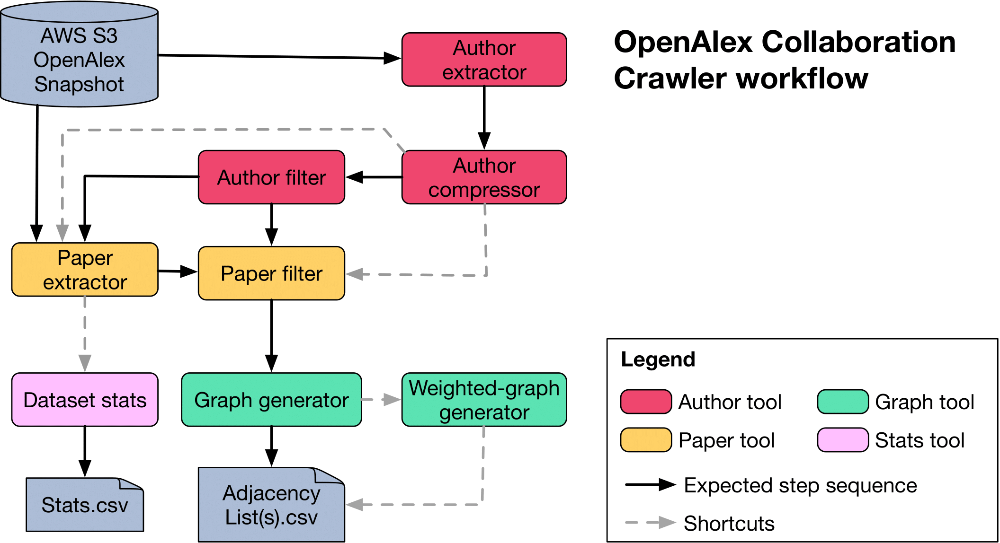

# OpenAlex Collaboration Crawler

[](https://www.rust-lang.org/)

This repository contains the code to **extract and generate temporal collaboration networks** using data from
the [OpenAlex](https://openalex.org) snapshot.

The workflow is composed of several modular tools, each responsible for a specific step in the data extraction and
transformation process.



An example of the produced dataset can be found at:

[](https://doi.org/10.5281/zenodo.17257787)


---

## 🧩 Overview of the Workflow

The process is divided into **three main steps**:

1. **Author Extraction and Filtering**
2. **Paper Extraction and Filtering**
3. **Graph Construction**

Each step produces intermediate artifacts (typically in JSONL or CSV format) that serve as inputs for the following
stages.

---

## Step 1: Author

This step focuses on **extracting and processing author data** from OpenAlex snapshots to build a JSONL list of authors
and their yearly affiliations.

Unlike the full OpenAlex author dataset, this step produces a compact representation containing:

- The **author ID**
- An array of **known countries of affiliation by year**

All author-related operations are grouped into a single executable, which can run the substeps **individually or
together**.

### Step 1.1: Author Extractor & Author Compressor

Extracts basic author information from the OpenAlex snapshot files.

Since OpenAlex snapshots use incremental updates, this step **merges author entries** into a single consolidated JSONL
record per author, combining all available affiliations.

### Step 1.2: Author Filter (optional)

Filters authors by **country affiliation**. The output file includes only authors who have been affiliated with the
specified country **at any point in time**. This flag is optional and if not given, the filter phase will not occur.

## Step arguments:

- `--openalex-input-dir`: Directory in which the OpenAlex snapshot has been downloaded.
- `--country-code-filter`: Two letter country code to filter against for affiliations
- `--output-file-name`: Filename of step output

---

## Step 2: Paper

This step extracts and filters papers authored by the selected authors from Step 1.  
Unlike Step 1, the resulting JSONL file includes **complete metadata** for each paper as provided by OpenAlex.

### Step 2.1: Paper Extractor

Extracts papers from the OpenAlex snapshot that were **authored by any author** listed in the Step 1 output.  
Each JSONL entry contains the **full OpenAlex paper record**.

### Step 2.2: Paper Filter

Filters papers based on a **research topic** and the **country affiliation** of the authors.

A paper is kept in the output if it meets **both** of the following conditions:

1. The `concepts` field includes at least one entry matching the given topic filter.
2. At least one author of the paper was affiliated with the specified country **in the year of publication**.

---

## Step 3: Graph

The final step constructs the **collaboration network** as an adjacency list.

The resulting CSV file contains one row per collaboration and includes four fields:

| Year | Publication ID | Author ID 1 | Author ID 2 |
|------|----------------|-------------|-------------|

Each row represents a **pairwise collaboration** between two authors on a paper published in the given year.

### Timeframe Splitting

It is possible to generate separate adjacency lists for different time ranges.  
The timeframe filter should be provided as a comma-separated list of ranges in the format:

```csv
<start_year>-<end_year>,<start_year>-<end_year>,...
```

- If `<start_year>` is omitted, it includes **all years before** `<end_year>`.
- If `<end_year>` is omitted, it includes **all years after** `<start_year>`.

---

## 🧠 Summary

| Step | Purpose                                               | Output                                    |
|------|-------------------------------------------------------|-------------------------------------------|
| 1    | Extract, compress, and filter authors by country      | JSONL of authors with yearly affiliations |
| 2    | Extract and filter papers by topic and author country | JSONL of papers                           |
| 3    | Build collaboration graph                             | CSV adjacency list                        |
